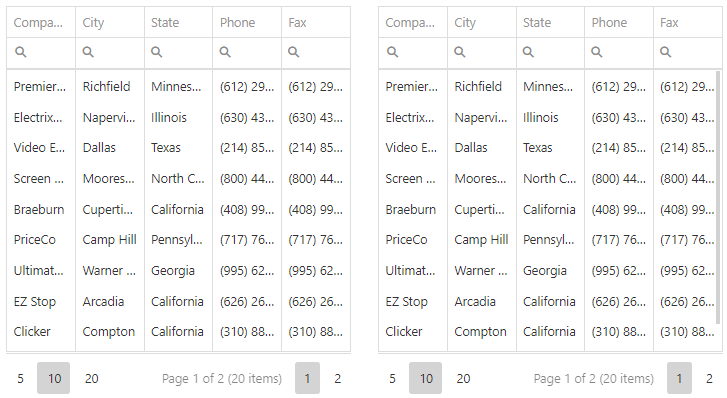

<!-- default badges list -->

<!-- default badges end -->
# DevExtreme DataGrid - How to synchronize two DataGrids

This example demonstrates how to synchronize two DataGrids. When any of the following changes are performed on the first DataGrid, the changes are applied to the second DataGrid: selection, filtering, sorting, pageSize and scrolling.

## Documentation

- [Getting Started with DataGrid](https://js.devexpress.com/Documentation/Guide/UI_Components/DataGrid/Getting_Started_with_DataGrid/)

- [DataGrid - API Reference](https://js.devexpress.com/Documentation/ApiReference/UI_Components/dxDataGrid/)
